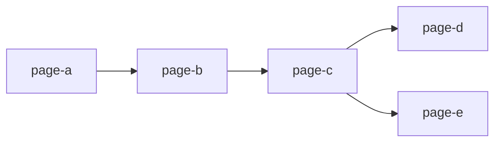
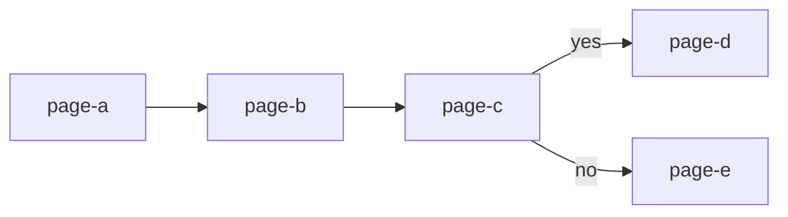
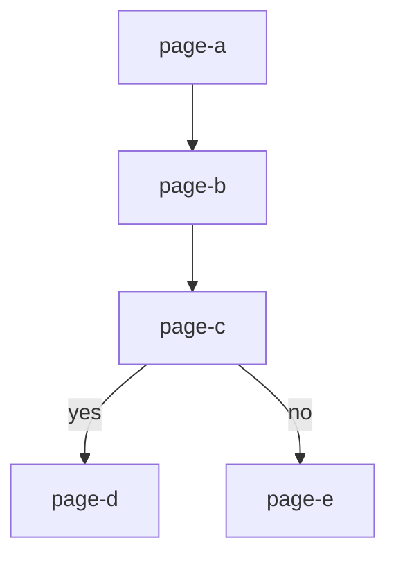

# casa-mermaidplan 🧜‍♀️

[](https://coveralls.io/github/gunjam/casa-mermaidplan)
[](https://standardjs.com)

A simple utility to convert a [CASA](https://github.com/dwp/govuk-casa)
Plan into [mermaid](https://mermaid-js.github.io/mermaid/#/) [flowchart](https://mermaid-js.github.io/mermaid/#/flowchart) notation, which can be then used in webpages alongside mermaid.js or
in the [live editor](https://mermaid-js.github.io/mermaid-live-editor/edit).

* [Installation](#installation)
* [Usage](#usage)
  * [Command Line](#command-line)
  * [Programmatically](#programmatically)

## Installation

```bash
npm install casa-mermaidplan -g
```

or as a dependency:

```bash
npm install casa-mermaidplan --save
```

## Usage

### Command Line
```
Usage: mermaidplan [opts]

Available options:
  -p/--plan
    Path to plan file, file must export a Plan or a function that returns a Plan.
  -l/--labels
    Label graph edges with route condition function names.
  -d/--direction
    Direction of graph, must be either:
    TB - top to bottom
    TD - top-down, same as top to bottom
    BT - bottom to top
    RL - right to left
    LR - left to right
  -h/--help
    Print this menu.
```

For the following plan:

```javascript
// plan.js
'use strict'

const { Plan } = require('@dwp/govuk-casa')

const plan = new Plan({})

plan.addSequence('page-a', 'page-b', 'page-c')

plan.setRoute('page-c', 'page-d', function yes (r, c) {
  return c.data['page-c'].field === 'yes'
})

plan.setRoute('page-c', 'page-e', function no (r, c) {
  return c.data['page-c'].field === 'no'
})

module.exports = plan
```

`mermaidplan -p plan.js` will output:

```
graph LR
  page-a --> page-b
  page-b --> page-c
  page-c --> page-d
  page-c --> page-e
```


You can also label the graph edges with route condition function names:

```
mermaidplan -p plan.js -l

graph LR
  page-a --> page-b
  page-b --> page-c
  page-c -->|yes| page-d
  page-c -->|no| page-e
```


Set the graph direction:

```
mermaidplan -p plan.js -l -d td

graph TD
  page-a --> page-b
  page-b --> page-c
  page-c -->|yes| page-d
  page-c -->|no| page-e
```


Or redirect the stdout into a file:

```
mermaidplan -p plan.js > plan.mmd
```

Combined with the [mermaid-cli](https://github.com/mermaid-js/mermaid-cli) tool,
you can produce SVG flowcharts straight from the command line:

```
mermaidplan -p plan.js | mmdc -o plan.svg
```

### Programmatically

#### Syntax

```javascript
planToMermaid(plan[, showLabels, direction]);
```

#### Parameters

- `plan` a CASA Plan or function that returns a Plan
- `showLabels` boolean value, show edge labels
- `direction` string, set direction of flowchart: TB, TD, BT, RL or LR

#### Example

```javascript
'use strict'

const planToMermaid = require('casa-mermaidplan')
const plan = require('./plan.js')

const notationLeftRight = planToMermaid(plan)
// graph LR
//   page-a --> page-b
//   page-b --> page-c
//   page-c --> page-d
//   page-c --> page-e

const notationLabelled = planToMermaid(plan, true)
// graph LR
//   page-a --> page-b
//   page-b --> page-c
//   page-c -->|yes| page-d
//   page-c -->|no| page-e

const notationTopDown = planToMermaid(plan, false, 'TD')
// graph TD
//   page-a --> page-b
//   page-b --> page-c
//   page-c --> page-d
//   page-c --> page-e
```
